# 数据结构

## 基本概念

数据结构是一门研究非数值计算的程序设计中计算机的操作对象以及它们之间关系和操作的学科。

### 逻辑结构

​    数据的逻辑结构指的是数据之间的逻辑关系，是在人类感官上的数据的组织形式。通过数据的逻辑关系来对数据结构进行分类的话可以将其分成以下四类：

1. 集合
   
    集合属于同属关系，譬如每个人都有一个同属关系人类，但是我们都是人类之外没有其他的任何关系（或许应该换一个例子）。

2. 线性结构
   
    在线性结构中每一个数据元素有一对一的关系，除了其中的首个元素和最后一个元素只有后驱元素或前驱元素以外，剩余的每个数据元素都有一个前驱元素和后驱元素，这种结构就像排队一样只有每个人之间的前后关系。
   
   

3. 树形结构
   
    树形结构是一对多的关系，就像家庭中的父子关系一样。一个父亲对应有一个或多个子女，但是子女却只有一个父亲。
   
   

4. 图形结构
   
   图形结构式多对多的关系，参考人类的朋友关系。我有非常多的朋友，我的朋友们同样也有非常多的朋友。
   
   
   
   ### 存储结构

​    存储结构与逻辑结构不同，逻辑结构是面向用户的机构，而存储结构是面向计算机的结构，是物理上的结构。存储结构可以分成以下四种：

1. 顺序存储结构
   
    ​    顺序存储结构种的相邻两个数据元素在物理空间上是相邻的，同是在逻辑关系上也是相邻的。
   
   

2. 链式存储结构
   
    ​    链式存储结构结构的相邻元素并不追求物理存储空间上的连续，其元素间的逻辑关系使用元素中的逻辑关系指针来表示。如下图，每个数据元素由两部分构成，一部分是存储数据的数据域，另一部分是存储逻辑关系指针的指针域：
   
   

3. 索引存储结构
   
    ​    索引存储是使用建表的方式来对数据进行存储的，其中单个索引的组成为索引关键字+数据地址。
   
   | 索引   | 地址       |
   |:---- |:-------- |
   | key1 | address1 |
   | key2 | address2 |
   | key3 | address3 |

4. 散列存储结构
   
    ​    散列存储结构严格上来说也是索引存储结构的一种，和索引存储结构相同，也是由索引关键字和数据地址组成。但是不同的地方是散列存储结构结构的数据地址是通过给定的索引关键字由散列函数计算出来的（散列函数计算出来的地址如果占用将重新计算数据地址直至没有冲突为止）。

### 逻辑结构与存储结构的关系

- 逻辑结构是逻辑关系的映像与元素本身的映像。

- 逻辑结构是数据结构的抽象，存储结构是数据结构的实现。

- 两者综合起来建立了数据元素之间的结构关系。

### 数据的操作

​    在软件系统当中，所有的功能实现都离不开数据的操作。常见的数据操作如下：

1. 创建操作：创建数据的存储结构
2. 销毁操作：销毁数据结构，释放其占用空间
3. 插入操作：在存储结构上的某个为止插入一个数据元素
4. 删除操作：删除存储结构某个位置上的数据元素
5. 查找操作：查找存储结构上满足指定条件的数据元素
6. 修改操作：修改数据结构上某个数据元素的值
7. 遍历操作：访问存储结构中的每一个数据元素，访问且仅仅访问一次

### 算法的定义

对特定问题求解方法和步骤的一种描述，它是指令的有限序列。其中每个指令标识一个或多个操作。

### 算法的性质

1. 有穷性：在任何情况下，算法都会在有限的步骤下且在有穷的时间内结束。
2. 确定性：
   1. 算法的每一条指令都有其确定的含义。
   2. 在任何条件下算法对于同一组输入都会有相同的一组输出。
3. 有效性：组成算法的每一条指令都必须是能够被人或机器确切执行的。
4. 通用性：对于那些符合输入类型的任意输入数据,都能根据算法进行问题求解,包保证计算结构的正确性。

在设计算法时要考虑下面四个性质来对算法进行设计：

1. 正确性：算法应当满足设计问题的需求。
2. 可读性：在保证正确性的情况下，算法的语句应当尽可能的保证其便于阅读。
3. 健壮性：算法应该有检查错误和处理错误的能力，既拥有一定的容错性。
4. 高效率：算法应该尽可能少的占用资源（空间上和时间上）。

### 算法的时间复杂度

​    算法的时间复杂度是问题的规模在时间上的反映，但有不是算法执行的具体时间，具体来说算法的时间复杂度反映的是算法执行时间的==增长趋势==。一般来说它由BigO表示法来表示。

$$
T（n) = O(f(n))
$$

​    其中的f(n)为代码的执行次数之和。

**分析算法时间复杂度的基本方法**

若f(n)=a_mn^m+a_{m-1}n^{m-1}...a_1n+a_0是m次多项式，则T(n)=O(n^m)

也就是或忽略掉低次幂项数和最高次幂系数，体现出增长率的含义。

1. 找出语句频次最大的那条语句作为基本语句

2. 计算基本语句的频度得到问题规模*n*的某个函数*f(n)*

3. 取其数量级用符号"O"标识

```java
int n = Integer.MAX_VALUE;  // 1
for(int i = 0;i < n;i++){  // 1+n
    for(int j = 0;j < n;j++){  //n(n+1)
        for(int k = 0;k < n;k++){  //n^2(n+1)
            System.out.println(i*j*k);  //n^3
        }
    }
}
```

​    上述算法的代码执行次数之和为$2n^3+2n^2+2n+2$，使用BigO表示法表示为$T(n) = O(n)$，严格上来说时间复杂度应该是$T(n) = O(2n^3+2n^2+2n+2)$，但是依然会简化为$T(n) = O(n^3)$，因为BigO表示法用于表示计算的增长变化趋势。

​    在这个例子当中n已经是一个足够大的值，假如说n是无穷大的话，其中$n^3$的倍数2以及$2n^2+2n+2$对时间的影响已经不大了。

### 算法的空间复杂度

​    由时间复杂度可以知道，既然时间复杂度反映的不是算法具体的执行时间，而是算法执行时间的增长趋势，那么算法的空间复杂度也不是反映算法具体占用的内存空间，而是算法占用内存空间的增长趋势。
$$
S(n) = O(f(n))
$$

## 线性表

​    线性表是最基本、最简单、也是最常用的一种数据结构。线性表是数据结构的一种，一个线性表是n个具有相同特性的数据元素的有限序列。

​    在计算机中线性表可以用两种存储结构来表示，其中用顺序存储结构表示的线性表称为**顺序表**，用链式存储结构表示的线性表成为**链表**。

### 顺序表

​    顺序表就是顺序存储的线性表，是用一组地址**连续的存储单元**一次存放线性表中各个数据元素的存储结构。数组就完全能够胜任作为顺序表容器这个任务。

​    因为顺序表是顺序存储的：

1. 顺序表逻辑相邻的数据元素在物理存储位置上也是相邻的。
2. 其存储密度高，由特点1可以知道其物理存储位置是相邻的，但是又要预先分配足够多的存储空间给顺序表，这样可能会造成存储空间的闲置浪费空间资源。
3. 便于随机存取，但是不便于插入和删除操作。由特点1可以知道插入或删除会使得数据表中的大量数据元素要在逻辑位置和物理位置上进行移动，以确保其顺序表的逻辑相邻和物理存储位置相邻。

​    因为其实现只是增删改查几个简单操作方法的实现，这里就直接给出实现了。

```java
package list;

public class SeqList<T> implements IList {
    private T[] listElements = null;
    private int length = 0;

    SeqList(T[] list) throws Exception {
        if (list.length > 64) {
            this.listElements = list;
        } else if (list.length <= 64 & list.length > 0) {
            this.listElements = (T[]) new Object[64];
            insert(list, 0);
        } else if (list.length == 0) {
            listElements = null;
        } else {
            throw new IndexOutOfBoundsException();
        }
    }

    public SeqList(int length) {
        if (length < 0)
            throw new IndexOutOfBoundsException();
        this.listElements = (T[]) new Object[length];
    }

    public SeqList() {
        this.listElements = (T[]) new Object[64];
    }

    @Override
    public int getLength() {
        return this.length;
    }

    @Override
    //插入记录到顺序表中，如果目标位置为空则插入到最后一个非空记录后
    public void insert(Object value, int index) {
        if (this.length + 1 >= listElements.length || index < 0 || index > this.listElements.length - 1)
            throw new IndexOutOfBoundsException();
        if (this.listElements[index] == null) {
            for (int i = index; i >= 0; i--) {
                if (i == 0 && this.listElements[0] == null) {
                    this.listElements[0] = (T) value;
                    this.length++;
                    break;
                } else if (this.listElements[i] == null)
                    continue;
                else if (this.listElements[i] != null) {
                    this.listElements[i + 1] = (T) value;
                    this.length++;
                    break;
                }
            }
            return;
        }

        for (int i = length + 1; i > index; i--)
            this.listElements[i] = this.listElements[i - 1];
        this.listElements[index] = (T) value;
        this.length++;
    }

    @Override
    public void insert(Object[] listElements, int index) throws Exception {
        if (this.length + listElements.length > this.listElements.length)
            throw new Exception();
        if (index < 0 || index > this.listElements.length - 1)
            throw new IndexOutOfBoundsException();
        for (int i = index, j = 0; i < index + listElements.length; i++, j++)
            this.insert(listElements[j], i);
    }

    @Override
    public void remove(int index) {
        if (index < 0 || index >= this.length)
            throw new IndexOutOfBoundsException();

        for (int i = index; i + 1 < this.length; i++) {
            this.listElements[i] = this.listElements[i + 1];
        }
        this.listElements[this.length - 1] = null;
        this.length--;
    }

    @Override
    public int valueOf(Object value) {
        for (int i = 0; i < this.length; i++) {
            if (value.equals(this.listElements[i]))
                return i;
        }
        return -1;
    }

    @Override
    public T get(int index) {
        if (index < 0 || index >= this.length)
            throw new IndexOutOfBoundsException();
        return this.listElements[index];
    }

    @Override
    public String toString() {
        StringBuffer sb = new StringBuffer();
        sb.append("{");
        for (int i = 0; i < this.listElements.length; i++) {
            if (listElements[i] != null)
                sb.append(String.valueOf(listElements[i]));
            if (i + 1 < this.listElements.length && listElements[i + 1] != null)
                sb.append(",");
        }
        sb.append("}");
        return sb.toString();
    }

    @Override
    public void set(Object t, int i) {
        this.listElements[i] = (T)t;
    }
}
```

### 链表

​    顺序表虽然方便随机存储但是其在物理存储空间是连续的，在线性表需要扩容时或是在需要进行插入、删除操作时是非常不方便的。对于需要频繁插入删除的动态线性表一般选择其链式存储实现。

#### 单链表

​    首先了解一下组成单链表的Node对象，


​    Node对象分成两个区域，一个区域为数据域（存储记录数据），另一区域为引用域（存储下一个节点的引用）。

​    单链表中存有链表的头指针，也就是指向第一个节点的引用。要访问剩下的其他节点就需要从头指针中拿到下一个节点的引用来进行访问，重复这样的步骤就可以访问到链表中的所有节点。

​    链表中的数据是以结点来表示的，每个结点的构成：元素(数据元素的映象) + 指针(指示后继元素存储位置)，元素就是存储数据的存储单元，指针就是连接每个结点的地址数据。

#### 循环链表

#### 双向链表

## 栈与队列

### 栈

​    栈(Stack)是一种特殊的线性表，特点可以描述为后入先出。然后栈根据存储结构的不同可以分为顺序栈（顺序存储结构）和链式栈（链式存储结构），可以把栈看作是向上开口的容器，最先放入到容器当中的元素在最底部，最后放入容器的元素在最顶部，能够操作的元素只能是在容器最顶部的元素。

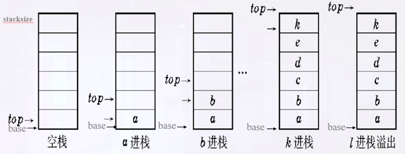

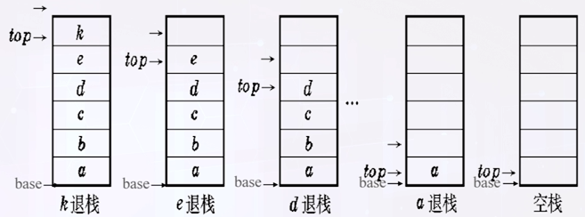

#### 栈的基本操作

* Clear：空栈

* isEmpty：判断栈是否为空

* isFull：判断栈是否为满，如果存储结构为链式存储结构则无栈满

* push：压入元素

* pop：取出元素

* peek:取栈顶元素不对栈顶指针作修改

#### SeqStack(顺序栈)

​    使用顺序存储结构作为栈的容器结构，使用类变量top存储栈顶的索引位置作为栈顶指针。

##### SeqStack具体实现

```java
package stack;

public class SeqStack implements Stack {
    private int top = -1;
    private Object[] stackElements;

    SeqStack() {
        this(64);
    }

    SeqStack(int length) {
        stackElements = new Object[length];
    }

    @Override
    public boolean isEmpty() {
        return top == -1;
    }

    @Override
    public boolean isFull() {
        return top == stackElements.length - 1;
    }

    @Override
    public void push(Object element) throws Exception {
        if (isFull())
            throw new Exception("栈满...");
        else if (stackElements == null)
            throw new Exception("容器未创建...");
        stackElements[++top] = element;
    }

    @Override
    public Object pop() {
        if (isEmpty())
            return null;
        else
            return stackElements[top--];
    }

    @Override
    public Object peek() {
        return stackElements[top];
    }

    @Override
    public void clear() {
        top = -1;
        stackElements = null;
    }

    @Override
    public int getLength() {
        return stackElements.length;
    }

    @Override
    public String toString() {
        StringBuffer sb = new StringBuffer();
        sb.append("{");
        for (int i = 0; i < stackElements.length; i++) {
            if(stackElements[i]!=null) {
                sb.append(stackElements[i]);
                if (i != stackElements.length - 1)
                    sb.append(",");
            }
        }
        sb.append("}");
        return sb.toString();
    }
}
```

#### LinkedStack(链式栈)

​    使用链式存储结构作为栈的容器结构，使用Node类实例top作为栈顶指针指向最顶部元素。

##### LinkedStack具体实现

```java
public class LinkedStack implements Stack {

    private Node top;

    @Override
    public void clear() {
        top = null;
    }

    @Override
    public int getLength() {
        Node p = top;
        int count = 0;
        while(p!= null) {
            count++;
            p = p.getNext();
        }
        return count;
    }

    @Override
    public boolean isEmpty() {
        return top == null;
    }

    @Override
    public boolean isFull() {
        return false;
    }

    @Override
    public void push(Object element) throws Exception {
        top = new Node(element,top);
    }

    @Override
    public Object pop() {
        if(!isEmpty()) {
            Object data = top.getData();
            top = top.getNext();
            return data;
        }
        return null;
    }

    @Override
    public Object peek() {
        return top.getData();
    }

    public String toString(){
        ...
    }
}
```

### 队列

​    队列可以认为是一个有前后开口的容器，其中一个口作为入口一个口作为出口。其根据存储结构又能分成顺序队列和链式队列。

#### 队列的基本操作

* clear：清空队列

* isEmpty：判断空队列

* length：队列长度

* peek：取队列首元素

* offer：入队

* poll：出队

#### 顺序队列

​    索引为0的位置作为队列头，每次取出元素重队列头取出，插入元素从队列尾插入。

##### 单队列

​    单队列是最常见的队列，但是因为单队列每次添加新元素都是从队尾位置添加的原因会出现假溢出的情况，即空取现象。

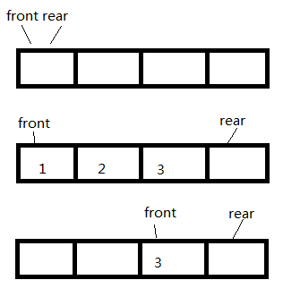

​    如上图，每一个元素入队rear指针向后移动一位，每一个元素出队front指针向后移动一位。

​    取出两个元素以后，front就来到了3的位置，此时有两个空位，如果要插入两个元素的话rear指针就需要向后移动两位，这样rear指针就已经指到到了容器空间以外了。

##### 循环队列

​    为了避免上面所说的假溢出情况出现可以改为使用循环队列，这里给出两种方法实现：

1. 少用一个存储单元
2. 添加flag标记

###### 第一种

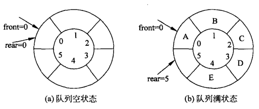

​    这种方法实现循环队列少用一个存储单元方便用来判断队列满和队列空。

状态判断：

​    判断队列满：**(rear+1)%queue.length == front**

​    入队后rear指针的变动：**rear = (rear+1)%queue.length**

​    出队后front指针的变动：**front = (front +1)%queue.length**

核心实现

```java
    @Override
    public boolean isEmpty() {
        return front == rear;
    }

    @Override
    public boolean isFull() {
        return front == (rear + 1) % elements.length;
    }

    @Override
    public void offer(Object element) throws Exception {
        if (isFull()) {
            throw new Exception("队列满...");
        }
        else {
            elements[rear] = element;
            rear = (rear+1)%elements.length;
        }
    }

    @Override
    public Object poll() throws Exception {
        if(isEmpty()) {
            throw new Exception("队列空...");
        }else {
            Object temp = elements[front];
            front = (front+1)%elements.length;
            return temp;
        }
    }
```

###### 第二种

​    第二种方法则不需要额外空出一个存储单元来，但是需要创建一个标记变量来标记上次对队列的操作是入队还是出队。

状态判断：

​    队列满：**rear==front&&flag == true**

​    队列空：**rear==front&&flag == false**

​    其中flag为true时说明队列的上一步操作是元素入队，flag为false时说明队列的上一步操作是元素出队或没有过操作。

核心实现：

```java
    @Override
    public boolean isEmpty() {
        return rear==front&&!flag;
    }

    @Override
    public boolean isFull() {
        return rear==front&&flag;
    }
    @Override
    public void offer(Object element) throws Exception {
        if(isFull()) {
            throw new Exception("队列满...");
        }else {
            elements[rear] = element;
            rear = (rear+1)%elements.length;
            this.flag = true;
        }
    }

    @Override
    public Object poll() throws Exception {
        if(isEmpty()) {
            throw new Exception("队列空...");
        }else {
            Object temp = elements[front];
            front = (front+1)%elements.length;
            this.flag = false;
            return temp;
        }
    }
```

#### 链式队列

​    链式队列是使用连式存储结构的队列，相对来说没有什么特殊之处。但是需要注意的是，当front与rear都为null时队列为空，当poll到最后一个元素时（即队列不为空且front与rear指向同一位置时）需要把rear也设置为null，因为此时rear依旧保存原来的元素，此时队列应该为空却不为空（front通过rear.getNext()已经设置为null）。

​    具体实现如下：

```java
package queue;

public class LinkedQueue implements Queue {
    Node front, rear = null;

    @Override
    public void clear() {
        front = rear = null;
    }

    @Override
    public boolean isEmpty() {
        return front == rear && front == null;
    }

    @Override
    public boolean isFull() {
        return false;
    }

    @Override
    public int getLength() {
        int length = 0;
        for (Node temp = front; temp != rear && temp != null; temp = temp.getNext()) {
            length++;
        }
        return length;
    }

    @Override
    public Object peek() {
        return front.getData();
    }

    @Override
    public void offer(Object element) throws Exception {
        if (isEmpty()) {
            front = rear = new Node(element);
        } else {
            rear.setNext(new Node(element));
            rear = rear.getNext();
        }
    }

    @Override
    public Object poll() throws Exception {
        if (isEmpty()) {
            throw new Exception("队列空...");
        } else {
            Object temp = front.getData();
            if (front == rear)
                rear = null;
            front = front.getNext();
            return temp;
        }
    }

}
```

#### 优先级队列

​    优先级队列是将数据按照优先级大小进行存储的队列，为了快速的访问到优先级高的元素和快速的插入操作通常选择链式存储结构来实现。

​    具体操作除入队前进行遍历操作找到当前优先级适宜的插入位置进行插入外，与链式队列基本相同。

```java
package queue;

public class PriorityQueue implements Queue{
    private Node front,rear;

    @Override
    public void clear() {
        front = rear = null;
    }

    @Override
    public boolean isEmpty() {
        return front == rear && front == null;
    }

    @Override
    public boolean isFull() {
        return false;
    }

    @Override
    public int getLength() {
        int length = 0;
        for (Node temp = front; temp != rear && temp != null; temp = temp.getNext()) {
            length++;
        }
        return length;
    }

    @Override
    public Object peek(){
        if(isEmpty()) {
            return null;
        }else {
            return front.getData();
        }
    }

    @Override
    public void offer(PriorityData element) throws Exception {
        if(isEmpty()) {
            front = rear = new Node(element);
        }else{
            Node temp = front,p = front;
            while(p!=null&&element.getPriority()<=p.getData().getPriority()) {
                temp = p;
                p = p.getNext();
            }
            Node n = new Node(element);
            if(p == null) { //判断结果为插入位置为队尾
                temp.setNext(n);
            }else if(temp == null) { //判断结果为插入位置为队首
                n.setNext(front);
                front = n;
            }else { //队列中
                n.setNext(p);
                temp.setNext(n);
            }
        }
    }

    @Override
    public PriorityData poll() throws Exception {
        if(isEmpty()) {
            throw new Exception("队列空...");
        }else {
            Node temp = front;
            if (front == rear)
                rear = null;
            front = front.getNext();
            return temp.getData();
        }
    }
}
```

## 串

​    串跟顺序表其实是一样的，只不过其中存储的数据限定为字符数据，具体也没什么好说的。需要注意一下的事KMP匹配算法。

### KMP

​    使用KMP算法是为了避免子串查找操作中出现的不必要回溯。使用KMP匹配子串时，模式串和主串进行比较如果有一位字符不匹配时不需要进行回溯，一般分为两种情况。 

​    首先了解一下什么是最大重复项。比如说模式串进行比较时，模式串中某一位与主串中某一位不匹配。

p0

如上图，模式串中p5和主串中t9不匹配，这种情况KMP算法就需要p5前的最大重复项。从p0和p4开始：

1. p0和p4比较，"a"!="b"不相同。
2. p0,p1和p3,p4比较,"ab"="ab"相同,这是一个长度为2的重复项。
3. p0,p1,p2和p2,p3,p4比较，"abc"!="cba"
4. p0,p1,p2,p3和p1,p2,p3,p4比较,"abca"!="bcab"
5. p0,p1,p2,p3,p4和p0,p1,p2,p3,p4，这时候就不用比较了，最大重复项就是长度为2的那个重复项。因为后者的起始位置已经到了模式串的头部了，这个情况不能叫重复了，可以叫做覆盖了。比较的结果是必定相等的但是不是我们要的重复项。

所以p5的最大重复项就是"ab"。

1. 之前匹配的字符当中不含有最大重复项，此时从该位开始重新与模式串进行匹配不需要回溯。
   
    

2. 之前匹配的字符当中含有最大重复项，模式串从开头的最大重复项后一位与目标串匹配
   
    
   
    ​    每次失配以后都不需要进行回溯，但是需要确认下一次模式串与目标串匹配开始的位置，这个位置可以通过next数组知道。

#### 求next数组

##### 基本原理

易知next[0] = -1，next[1] = 0

假设有模式串ababaaa

next[2]


头尾都没有最大重复项，故next[2] = 0

next[3]


头尾有最大重复项a和a，长度为1，故next[3] = 1

next[4]


头尾有最大重复项ab和ab，长度为2，故next[5] = 2

next[5]


头尾有最大重复项aba和aba，长度为3，故next[5] = 3

next[6]


头尾有最大重复项a和a，长度为1，故next[6] = 1

##### 算法实现

```java
public int[] getNext(char[] chs){
    int[] next = new int[chs.length];
    int i = 0;
    int j = 1;
    next[0] = -1;
    next[1] = 0;
    while(j<chs.length - 1){
        if(chs[i] == chs[j]){
            //如果匹配，继续查找下一位是否也匹配
            next[j+1] = i + 1;
            j++;
            i++;
        }else if(i == 0){
            //不匹配，尾指针向后移一位
            next[j+1] == 0;
            j++;
        }else{
            //i = next[i]在这里的含义是，已经再找不到更大的最大匹配项了
            //将头指针往回退寻找较小的最大匹配项，直到最后i==0，尾指针向后移获取下一位的最大匹配项长度
            i = next[i];
        }
    }

    return next;
}
```

#### kmp算法匹配子串

```java
public int indexOfSubString(char[] chs,char[] Tchs,int start,int[] next){
    int i = start;
    int j = 0;
    while(i<chs.length-1&&j<Tchs.length-1){
        if(j==-1||chs[i]==Tchs[j]){
            i++;
            j++;
        }else{
            j = next[j];
        }
    }
    if(j<Tchs.length){
        //不匹配
        return -1;
    }else{
        //匹配
        return i - Tchs.length;
    }
}
```

## 树

树是 n（n >= 0 ）个结点的有限集合，n = 0 时，称为空树。在任意一棵非空树中应满足：

1. 有且仅有一个特定的称为根的结点。
2. 当 n > 1 时，其余结点可分为 m （ m > 0）个互不相交的有限集合，其中每一个集合本身又是一棵树，并且称为根结点的子树。

显然**树**的定义是递归的，**是一种递归的数据结构**。树作为一种逻辑结构，同时也是一种**分层**结构，具有以下

  两个特点：

1. 树的根结点没有前驱结点，除根结点之外的所有结点有且只有一个前驱结点。
2. 树中所有结点可以有零个或多个后继结点。

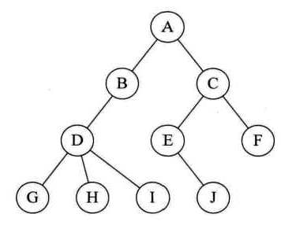

下面来了解一下有关于树的基本术语：

1. 树的节点：树中的一个数据元素就是一个节点，如上图中的A、B、C、D都是树的节点。
2. 节点的路径：节点的路径指的是**根节点**到这个节点所经过的边和节点的顺序排列，如G的路径是A->B->D->G。
3. 路径的长度：路径的长度指的是节点路径中包含的分支数，如G的路径途经分支B、D、G故路径长为3。
4. 节点的度：当前节点拥有的子树数目。
5. 树的度：所有节点度的最大值。
6. 叶子结点：树中度为0的节点，也成为终端节点，因为它已经没有后继节点了。
7. 子节点：节点的后继节点。
8. 父节点：节点的前驱节点。
9. 子孙节点：节点下的所有节点。
10. 祖先节点：节点的路径中除当前节点外的所有节点。
11. 兄弟节点：和当前节点同一父节点的所有结点。
12. 节点的度：在节点的路径中当前节点排第几（其中根节点排0），那么当前节点的度就为几。
13. 树的深度：当前树最大节点的度+1就是树的深度。
14. 森林：n（n>=0)颗互不相交的树构成的集合。

有序树和无序树：

​    树的所有节点有严格的左右次序之分的树成为有序树，其子树位置的不同对应的有序树也不同。无需树则反之。

### 二叉树

​    二叉树是**有序树**，并且其每个节点最多只能有两棵子树，并且这两棵子树也是二叉树，当然也可以没有子树或只有一棵子树。

#### 满二叉树与完全二叉树


满二叉树：满二叉树是二叉树的一种特殊形态，满二叉树除了其叶子节点外，所有的节点都有两个子节点。

完全二叉树：某个有n个节点的完全二叉树其前n个节点的结构与满二叉树相同。

#### 二叉树的性质

1. 第i层上的节点最多有2^i^个。
2. 深度为h（h>=1）的二叉树最多有2^h^个。
3. 对于任何一棵二叉树，度为0的节点个数为n~0~，度为2的节点有n~2~，那么存在啊**n~0~ = n~2~ + 1**
4. 具有n个节点的完全二叉树，其深度为(log~2~n) + 1或log~2~(n+1)
5. 对于一个完全二叉树，从根节点开始以上至下左至右开始编号，根节点编号i = 0
   1. 除根节点外编号为i的节点的父节点编号为**(i-1)/2**。
   2. **2i+1**和**2i+2**是编号为i的节点的子节点编号，如果2i+1和2i+2小于树的节点总数n的话。

#### 二叉树的存储结构

​    二叉树的存储结构可以分成顺序存储结构和链式存储结构。

##### 顺序存储结构

​    二叉树的顺序存储结构是按照顺序依次给二叉树当中的各个节点进行编号，然后将节点以其编号作为索引存入到顺序存储结构容器当中。

​    下面给出两个图帮助理解：

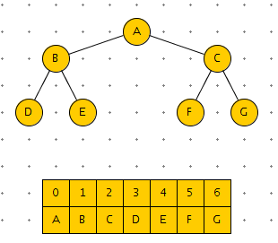


##### 链式存储结构

​    二叉树的链式存储结构可以分成二叉链表和三叉链表，其中二叉链表只包含左右子节点引用，三叉链表除了包含左右子节点引用以外还有父节点引用。一般推荐使用三叉链表实现，多了一个父节点引用在使用时会方便很多。

​    

三叉链表二叉树：

​        父节点引用：指向父节点

​        左孩子节点引用：指向左孩子节点

​        右孩子节点引用：指向右孩子节点

​        数据域：当前节点数据

三叉链表二叉树的基本实现：

```java
//节点类:
public class BinaryTreeNode {
    private BinaryTreeNode parent;
    private BinaryTreeNode leftChild;
    private BinaryTreeNode rightChild;
    private Object data;


    public BinaryTreeNode(Object data,BinaryTreeNode parent, BinaryTreeNode leftChild, BinaryTreeNode rightChild) {
        super();
        this.data = data;
        this.parent = parent;

        //设置欲设置到当前节点的节点的父节点为当前节点
        if(this.leftChild!=null)this.leftChild.setParent(this);
        if(this.rightChild!=null)this.rightChild.setParent(this);

        this.leftChild = leftChild;
        this.rightChild = rightChild;
    }

    public BinaryTreeNode(Object data,BinaryTreeNode leftChild, BinaryTreeNode rightChild) {
        super();
        this.data = data;
        this.leftChild = leftChild;
        this.rightChild = rightChild;

        //设置欲设置到当前节点的节点的父节点为当前节点
        if(this.leftChild!=null)this.leftChild.setParent(this);
        if(this.rightChild!=null)this.rightChild.setParent(this);
    }

    public BinaryTreeNode getParent() {
        return parent;
    }

    public void setParent(BinaryTreeNode parent) {
        this.parent = parent;
    }

    public BinaryTreeNode getLeftChild() {
        return leftChild;
    }

    public void setLeftChild(BinaryTreeNode leftChild) {
        this.leftChild = leftChild;
    }

    public BinaryTreeNode getRightChild() {
        return rightChild;
    }

    public void setRightChild(BinaryTreeNode rightChild) {
        this.rightChild = rightChild;
    }

    public Object getData() {
        return this.data;
    }

    public void setData(Object data) {
        this.data = data;
    }

}

public class BinaryTree {
    private BinaryTreeNode root;

    public BinaryTree() {
        this.root = null;
    }

    public BinaryTree(BinaryTreeNode root) {
        this.root = root;
    }

    public BinaryTreeNode getRoot() {
        return root;
    }

    public void setRoot(BinaryTreeNode root) {
        this.root = root;
    }
}
```

#### 二叉树的遍历

​    二叉树的遍历方式可以分成四种：

1. 层次便利
2. 先根遍历
3. 中根遍历
4. 后跟遍历

​    其中层次便利是对二叉树以从上至下从左至右的次序进行遍历。后面三种遍历方式可以说是一种只不过根据访问节点数据的时机不同分成了三种。比如说先根遍历，其访问结点数据的操作发生在遍历其左右子树之前，中根和后根遍历就是发生在访问左右子树之中和之后。

​    四种遍历的实现与其测试代码如下：

```java
    public void levelTraverse() throws Exception {
        LinkedQueue queue = new LinkedQueue();

        queue.offer(this.root);
        while(!queue.isEmpty()) {
            BinaryTreeNode head = (BinaryTreeNode)queue.poll();
            if(head.getLeftChild()!=null)queue.offer(head.getLeftChild());
            if(head.getRightChild()!=null)queue.offer(head.getRightChild());
            System.out.print(head.getData());
        }
        System.out.println();
    }
    public void inRootTraverse() {
        inRootTraverse(this.root);
        System.out.println();
    }
    public void inRootTraverse(BinaryTreeNode node) {
        if(node==null)return;
        inRootTraverse(node.getLeftChild());
        System.out.print(node.getData());
        inRootTraverse(node.getRightChild());
    }
    public void preRootTraverse() {
        preRootTraverse(this.root);
        System.out.println();
    }
    public void preRootTraverse(BinaryTreeNode node) {
        if(node==null)return;
        System.out.print(node.getData());
        preRootTraverse(node.getLeftChild());
        preRootTraverse(node.getRightChild());
    }
    public void postRootTraverse() {
        postRootTraverse(this.root);
        System.out.println();
    }
    public void postRootTraverse(BinaryTreeNode node) {
        if(node==null)return;
        postRootTraverse(node.getLeftChild());
        postRootTraverse(node.getRightChild());
        System.out.print(node.getData());
    }

    @Test
    public void func01() throws Exception {
        BinaryTree binaryTree = new BinaryTree();
        BinaryTreeNode root = new BinaryTreeNode("A",null,
                new BinaryTreeNode("B",
                        new BinaryTreeNode("D",
                                new BinaryTreeNode("H",null,null),
                                null),
                        new BinaryTreeNode("E",null,null)),
                new BinaryTreeNode("C",
                        new BinaryTreeNode("F",null,null),
                        new BinaryTreeNode("G", null, null))
                );
        binaryTree.setRoot(root);
        binaryTree.levelTraverse();
        binaryTree.preRootTraverse();
        binaryTree.inRootTraverse();
        binaryTree.postRootTraverse();
    }
```

输出结果：

> 层次遍历：ABCDEFGH
> 先根遍历：ABDHECFG
> 中根遍历：HDBEAFCG
> 后根遍历：HDEBFGCA

#### 哈夫曼树和哈夫曼编码

##### 概念

​    了解哈夫曼树之前需要先了解几个基本概念：

1. 节点的权和节点的带权路径长度
   
    给节点赋予一个有具体意义的数字称为该节点的权值。该节点的带权路径长度就是该节点的路径长度与该节点的权值的乘积。

2. 树的带权路径长度（WPL）
   
    树的带权路径长度是树中所有叶子节点的带权路径长度之和。

3. 最优二叉树（哈夫曼树）
   
    给定n个数值作为叶子结点的权值按照一定规律构造的一棵带权路径长度最小的二叉树称为最优二叉树（哈夫曼树）。

##### 构造

​    给定几个权值要如何构造哈夫曼树呢？

​    首先，根据给定的n个权值创建一个由n个二叉树组成的森林，假如给定五个权值1,2,3,4,5创建的森林如下：


​    然后在这个森林当中选择权值最小和权值次小的二叉树让它们分别作为左右子树去创建一个新的二叉树，重复这个步骤知道森林中只剩下一个棵二叉树为止。比如上面森林中权值最小和次小的二叉树是1和2将它们两个合并。

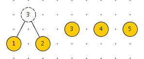

​    此时森林中最小和次小的权值都是3,将两个3合并。

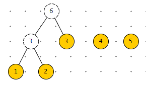

此时次小和最小是4和5,合并4和5。

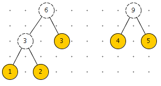

最后合并6和9就完成了哈夫曼树的构造。

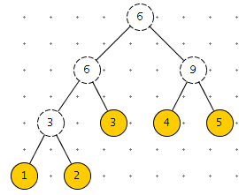

##### 编码

     哈夫曼树的编码是从叶子结点出发回归到根节点，过程中如果是向右上移动编码头部插“0”，如果是向做上移动则插“1”。

​    如上图中叶子节点1的编码为0000，叶子节点2的编码为0001。

##### 应用

​    哈夫曼树编码的应用应该就是在文档压缩上吧，用哈夫曼编码写了一个文件压缩，但是执行后发现压缩后的文件比原文件还大，可能是构造出来的哈夫曼树深度太大了吧。具体就不说了，贴个代码。

```java
    @Test
    public void func02() throws IOException {
        int n = 256; // 权值数
        int m = n * 2 - 1; // 哈夫曼树节点数
        File fi = new File("/data/home/nondirectional/data1.pdf");
        File fo = new File("/data/home/nondirectional/data2");
        if (!fi.isFile() || !fi.exists())
            return;
        if (!fo.exists())
            fo.createNewFile();

        // 频次统计
        FileInputStream fis = new FileInputStream(fi);
        int times[] = new int[n];
        byte[] temp = new byte[1];
        while (fis.read(temp) != -1)
            times[Byte.toUnsignedInt(temp[0])]++;

        HuffmanTreeNode[] htns = new HuffmanTreeNode[m];
        for (int i = 0; i < n; i++)
            htns[i] = new HuffmanTreeNode(times[i]);

        //构造哈夫曼树
        for (int i = n; i < m; i++) {
            HuffmanTreeNode min1 = minH(htns, i);
            min1.setFlag(true);
            HuffmanTreeNode min2 = minH(htns, i);
            min2.setFlag(true);
            htns[i] = new HuffmanTreeNode(min1.getWeight() + min2.getWeight(), min1, min2);
        }

        //哈夫曼树编码
        String[] codes = new String[n];
        for (int i = 0; i < n; i++) {
            HuffmanTreeNode node = htns[i];
            StringBuffer sb = new StringBuffer();
            while (node.getParent() != null) {
                if (node.equals(node.getParent().getLeftChild())) {
                    sb.append("0");
                } else {
                    sb.append("1");
                }
                node = node.getParent();
            }
            sb.reverse();
            codes[i] = sb.toString();
        }

        fis.close();
        //压缩和文件写入
        fis = new FileInputStream(fi);
        FileOutputStream fos = new FileOutputStream(fo);
        StringBuffer sb = new StringBuffer();

        while (fis.read(temp) != -1) {
            sb.append(codes[Byte.toUnsignedInt(temp[0])]);
            if (sb.length() < 8)
                continue;
            temp[0] = (byte) Integer.parseInt(sb.substring(0, 7), 2); // 这里不使用Byte.parseByte，其转换有问题
            fos.write(temp);
            sb.delete(0, 7);
        }

        while (sb.length() >= 8) {
            temp[0] = (byte) Integer.parseInt(sb.substring(0, 7), 2); // 这里不使用Byte.parseByte，其转换有问题
            fos.write(temp);
            sb.delete(0, 7);
        }
        if (sb.length() > 0) {
            temp[0] = (byte) (Integer.parseInt(sb.toString(), 2) << (8 - sb.length()));
            fos.write(temp);
        }
        fis.close();
        fos.close();
    }

    public static HuffmanTreeNode minH(HuffmanTreeNode[] htns, int end) {
        HuffmanTreeNode minH = htns[end - 1];
        for (int i = 0; i < end; i++)
            if (htns[i].getWeight() < minH.getWeight() && !htns[i].isFlag())
                minH = htns[i];
        return minH;
    }
```

### 树的存储结构

​    二叉树是树的一种特殊存在，它最多只能有左子和右子两个子树，树的话就不止了。所以其存储结构就不能参照二叉树了。

​    树的存储结构有很多种，基本上都是顺序存储结构和链式存储结构混合实现的。

1. 双亲链表存储结构
   
    所有节点都存储在一个顺序表中，其中每个节点包含两个信息，一是节点的数据域，二是节点的父节点在顺序表中的为止。

2. 孩子链表存储结构
   
    所有的节点都存储在一个顺序表中，其中每个节点也都包含两个信息，一是数据域，二是该节点所有孩子构成的链表。

3. 双亲孩子链表存储结构
   
    是上面两个存储结构的综合，节点包含三个信息，除数据域外还有子节点和父节点。

4. 孩子兄弟链表存储结构
   
    所有的节点都存储在一个顺序表中，每个节点都包含三个信息，除数据域外还有子节点和兄弟节点的引用。

## 图

### 图的基本概念

什么是图？

​    图是点与点之间的连接关系，由点、边构成。`G[图]= {V[点],E[边]}`

#### 有向图和无向图

无向图：点与点之间的对为无序对，如(A,B)。

有向图：点与点之间的对为有序对，如<A,B>。

#### 简单图和多重图

​    前者不存在重复的边和自身与自身连接的边。

#### 完全图

1. 无向完全图
   
    任意两个顶点之间都存在边，边的数量为`n(n-1)/2`

2. 有向完全图
   
    任意两个顶点之间都存在方向相反的两条边，边的数量为`n(n-1)`

#### 子图与生成子图

子图：存在`G(V,E)`与`G'(V',E')`有V包含V’,E包含E’责成G’为G的子图。

生成子图：`V(G) = V'(G')`则成G’为G的生成子图。

#### 路径

1. 简单路径
   
    两个点之间的路径中顶点不重复的路径为简单路径。

2. 路径长度
   
    路径上边的数目，如果这条路径最短，则称这条路径的路径长度为距离。

3. 回路
   
    第一个顶点与最后一个顶点相同的路径称为回路。

#### 连通图

什么是连通、强连通？

​    连通：假设无向图中有点A、B，A到B存在有路径则成A点与B点是连通的。

​    强连通：假设有向图中有点A、B，如果存在A到B和B到A的路径则称A点与B点是强连通的。

什么是连通图、强连通图？

​    连通图：图中任意两点都是连通的。

​    强连通图：图中任意两点都是强连通的。

什么是连通分量（极大连通子图）、强连通分量（极大强连通子图）？

​    首先需要确定，（强）连通分量是一个（强）连通图，并且这个连通图是原图当中能够找到的最大的两种连通图，即存在`G`的连通子图`G’`，在`G`当中不能够找到其他的连通子图`G''`包含`G'`。

​    如果连通分量的原图本身就是连通图的话，那么其连通分量就是其本身。

什么是极小连通子图？

​    和连通分量相反，是保证图连通的情况下最小的连通子图。

#### 生成树与生成森林

什么是生成树？

​    生成树的原图为连通图，生成树包含原图的全部顶点并且是极小连通子图

什么是生成森林 ？

​    ==非连通图==的==所有连通分量==的==生成树==的集合

​    有向树：一个顶点入度为0，其余顶点入度为1的有向图。

#### AOE网和AOV网

**AOV-网**：用顶点表示活动，用弧表示活动间的优先关系的有向图称为顶点表 示活动的网（Activity On Vertex Network), 简称AOV-网。 

与AOV-网相对应的是AOE-网（Activity On Edge) 即边表示活动的网。 

**AOE-网**： 是一个带权的有向无环图，其中，顶点表示事件（Event),弧表示活动，权表示活动持续的时间。 
通常，AOE-网可用来估算工程的完成时间。

从图还能够推出一个跟树结构类似的有向树，名字虽然是树但是其本质还是图。

### 邻接矩阵法构建图

邻接矩阵法构建图是顺序存储结构存储，一个数组存储顶点集，另一个二维数组存储顶点之间关系的有序对，这个二维数组即为邻接矩阵。

具体下来要分成两种情况创建，如果是图的话，邻接矩阵当中有边相连接用1表示没有则用0表示，如果是网的话每条边还有相应的权值。

无向图的邻接矩阵构成如下：


图中二维数组的第一行第二列的元素表示从顶点A到顶点B有一条有向边，第二行第一列的元素表示从顶点B到顶点A有一条有向边，两者一同表示A和B之间存在一条无向边。

一位数组当中携带的信息：顶点名称，顶点索引由顶点名称得到

同理可以有向图的构成

如果是网，邻接矩阵的值就不能够简单的用0和1来表示，因为顶点与顶点之间有相应的权值。如果顶点之间有相应的权值边，在邻接矩阵中相应位置元素的值为相应权值，如果顶点之间没有边，则邻接矩阵相应位置元素的值为正无穷(正无穷的值由自己定义)。

无向网的邻接矩阵构成如下：


另外，图邻接矩阵还有特殊的性质。

首先，在无向图的邻接矩阵的第i列或第i行的和为顶点V~i~的度，在有向图当中邻接矩阵第i行的和为顶点 V~i~的出度，第i列的和为顶点V~i~的入度。

其次，邻接矩阵的幂A^n^[i][j]的值的意义为顶点V~i~到顶点V~j~长度为n的路径的条数。

### 邻接表法构建图

邻接表法构建图使用到的是链式存储结构，分别有一个顶点集和边集，其中每个顶点元素除包含顶点数据外还有一个块存储空间存储该顶点的边集头指针。

图示如下：


有关图的具体构成代码在这里省略。

### 广度优先搜索

广度优先搜索类似于树的层次遍历，在图中以出发顶点到各顶点的路径长为层次。

### 深度优先搜索

### 最小生成树Prim法

       1. 使用上面两种搜索实现某些功能
                   2. 最小生成树prim法

## 查找

​    在了解查找之前要先了解关于查找表的概念。查找表是一种以同一类型的记录构成的逻辑结构，以查找为核心运算的数据结构。

​    建表的目的就是为了加快访问数据的速度，由于从内存中提取数值经常要比复杂的计算速度快很多，所以这样得到的速度提升是很显著的。一个经典的例子就是三角函数表。每次计算所需的正弦值在一些应用中可能会慢得无法忍受，为了避免这种情况，应用程序可以在刚开始的一段时间计算一定数量的角度的正弦值，譬如计算每个整数角度的正弦值，在后面的程序需要正弦值的时候，使用查找表从内存中提取临近角度的正弦值而不是使用数学公式进行计算。

​    另外根据查找方法对查找表的操作是否涉及到对查找表的修改将查找表分为**静态表查找**和**动态表查找**。

### 静态表查找

#### 顺序查找

​    顺序查找是最简单最基础的一种查找方式。其从表的一端开始一一的将表中的数据元素的关键字和给定的查找Key值进行比较。

```java
public RecordNode SeqSerch(Comparable key,RecordNode[] targetArr) {
    for(int i=0;i<targetArr.length;i++) {
        if(key.compareTo(targetArr[i].key)==0) 
            return targetArr[i];
    }
    return null;
}
```

#### 二分查找

​    二分查找的基本前提是查找对象必须是顺序存储的有序表（关键字为数值，以数值为依据，关键字为字符，以相应Unicode码大小为依据）。

​    查找步骤：

1. 取表中的中间元素，将表分成上表和下表。
2. 将关键字和中间元素进行比较，如果与中间元素相等则返回结果。
3. 如果关键字与中间元素相比较较大或较小，则取下表或上表继续上述的折半查找，直至找到目标元素或取得的中间元素是表头元素或表尾元素都还没有查找到目标元素。

```java
public RecordNode binarySerch(Comparable key,RecordNode[] targetArr) {
        int left = 0;
        int right = targetArr.length-1;


        while(left <= right) {
            int mid = (left+right)/2;
            //将关键字和中间元素进行比较，如果与中间元素相等则返回结果。
            int compareResult = key.compareTo(targetArr[mid].key);
            if(compareResult == 0) {
                return targetArr[mid];
            //如果关键字与中间元素相比较较大或较小，则取下表或上表继续上述的折半查找，直至找到目标元素或取得的中间元素是表头元素或表尾元素都还没有查找到目标元素。
            }else if(compareResult >0) {
                left = mid + 1;
            }else {
                right = mid -1;
            }
        }
        return null;
    }
```

### 动态表查找

#### 二叉排序树

​    二叉排序树相较于二分查找不单只同时具有其查找的效率，并且更加便于对数据元素的删除、插入操作。

​    参考下文中创建二叉排序树的代码，二叉排序树如非空树则满足以下性质：

1. 若左子树不为空，则左子树上所有节点的值均小于根节点的值。
2. 若右子树不为空，则右子树上所有节点的值均大于根节点的值。
3. 他的左右子树也都是二叉排序树。

##### 创建二叉排序树

```java
public BinaryTree createBinarySerchTree(RecordNode[] rs) {
    if(rs == null||rs[0] == null)return null;
    BinaryTree bt = new BinaryTree();
    //用传入输出的第一个元素作为二叉查找树的根节点
    bt.setRoot(new BinaryTreeNode(rs[0]));

    //辅助变量
    BinaryTreeNode currentTreeNode = bt.getRoot();

    for(int i=1;i<rs.length;i++) {
        if(rs[i]==null)return bt;
        currentTreeNode = bt.getRoot();
        while(true) {
            /*1. 比较当前插入元素的关键字与当前指向节点的关键字的大小
             *2. 如果相等，则表示该元素再书中已经存在，跳过这个元素插入下一个元素
             *   否则根据比较的结果并且当前指向节点的左子树或右子树不为空则把当前指向节点切换到当前指向节点的左子树或右子树并且回到第一步
             *   如果当前指向节点的左子树或右子树为空则将当前插入元素插入到这个位置，然后进入到写一个插入元素的插入操作
            */
            int compareResut = ((RecordNode)currentTreeNode.getData()).key.compareTo((KeyType) rs[i].key); 
            if(compareResut==0) {
                break;
            }else if(compareResut<0){
                if(currentTreeNode.getrChild()==null) {
                    currentTreeNode.setrChild(new BinaryTreeNode(rs[i]));
                    break;
                }else {
                    currentTreeNode = currentTreeNode.getrChild();
                }

            }else if(compareResut>0){
                if(currentTreeNode.getlChild()==null) {
                    currentTreeNode.setlChild(new BinaryTreeNode(rs[i]));
                    break;
                }else {
                    currentTreeNode = currentTreeNode.getlChild();
                }
            }
        }
    }
    return bt;
}
```

##### 插入节点

​    插入节点嘛，就没什么可说的了，大概就是拿着这个Key值在树上遍历，遍历到遍历不下去就那它做当前遍历到节点的左孩子或右孩子就行了。

```java
public void insertNode(RecordNode node) throws Exception {
        if(node.key==null)throw new Exception("试图插入不可比较对象。");
        if(this.bt.getRoot()==null) {
            bt.setRoot(new BinaryTreeNode(node));
            return;
        }

        KeyType key = (KeyType) node.key;
        BinaryTreeNode btn = this.bt.getRoot();
        while(btn!=null) {
            int compareResut = ((RecordNode)btn.getData()).key.compareTo(key);
            if(compareResut == 0) {
                return;
            }else if(compareResut >0) {
                if(btn.getlChild()==null) {
                    btn.setlChild(new BinaryTreeNode(node));
                    return;
                }else {
                    btn = btn.getlChild();
                }
            }else {
                if(btn.getrChild()==null) {
                    btn.setrChild(new BinaryTreeNode(node));
                    return;
                }else {
                    btn = btn.getrChild();
                }
            }
        }
    }
```

##### 删除节点

​    删除二叉排序树上的节点可以分成三种情况来处理：

1. 被删除的节点是叶子节点：这种情况最简单，只要把该节点直接删除就可以了。

2. 被删除的节点有左孩子或右孩子：这种情况删除该节点只要把该节点的父节点中指向该节点的指针替换成该节点的左孩子或右孩子即可。

3. 被删除的节点有左孩子和右孩子：这种情况要删除该节点首先要找出该节点的前趋节点或后继节点，然后把该节点替换成其前趋节点或后继节点。什么是前趋节点和后继节点？
   
    某个节点的前趋节点就是该节点左子树当中的最右节点（也既该节点左子树当中最大的节点），后继节点就是该节点右子树当中的最左节点（也既该节点右子树中最小的节点）。可以知道前趋节点或后继节点是没有右孩子或左孩子的，所以前趋节点和后继节点被删除之后其问题可以转换成1和2两种情况来解决。
   
    如下图：
   
    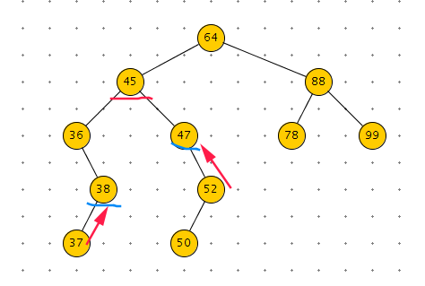
   
    要删除节点45，找到其前趋节点38，将37代替38成为36的右孩子，然后将45替换成38，或找到其后继节点47，将52代替47成为45的右孩子，然后将45替换47。最后要注意，在将45替换成38或45替换成47时要将38或47的左右孩子替换成45现在的左右孩子。

具体实现：

```java
    public Object deleteNode(Comparable key) {
        if(key == null)return null;
        BinaryTreeNode currentNode = bt.getRoot();
        BinaryTreeNode currentNode_parent = null;
        if(currentNode ==null) return null;
        Object returnData = null;
        //第一步,先在树中找到该节点。
        while(currentNode!=null) {
            int compareResult = ((RecordNode)currentNode.getData()).key.compareTo((KeyType) key);
            if(compareResult==0) {
                returnData = currentNode.getData();
                boolean hasRChild = currentNode.getrChild()!=null;
                boolean hasLChild = currentNode.getlChild()!=null;
                if(hasLChild^hasRChild) {  //仅有左子树或右子树
                    if(hasLChild) {
                        if(currentNode_parent.getlChild().equals(currentNode)) {
                            currentNode_parent.setlChild(currentNode.getlChild());
                        }else {
                            currentNode_parent.setrChild(currentNode.getlChild());
                        }
                    }else {
                        if(currentNode_parent.getlChild().equals(currentNode)) {
                            currentNode_parent.setlChild(currentNode.getrChild());
                        }else {
                            currentNode_parent.setrChild(currentNode.getrChild());
                        }
                    }
                }else if(hasLChild&&hasRChild) {  //有左右子树
                    //声明两个辅助变量来保存找到的前趋节点以及其父节点，方便后面对树结构的修改
                    BinaryTreeNode anteriorNode,anteriorNode_parent;
                    anteriorNode_parent = currentNode;
                    anteriorNode = currentNode.getlChild();

                    //寻找前趋节点
                    while(anteriorNode!=null) {
                        if(anteriorNode.getrChild()!=null) {
                            anteriorNode_parent = anteriorNode;
                            anteriorNode = anteriorNode.getrChild();
                        }else {
                            break;
                        }
                    }

                    /*先将前趋节点的左孩子吧前趋节点替换掉，这里要分两种情况
                     * 1. 找到的前趋节点就是被删除节点的左孩子：
                     *         这种情况要把前趋节点的父节点的左孩子替换成前趋节点的左孩子。
                     * 2. 找到的前趋节点不是1说说的情况：
                     *         这种情况直接把前趋节点的父节点的右孩子替换成前趋节点的左孩子就可以了
                     */
                    if(currentNode.getlChild().equals(anteriorNode)) {
                        anteriorNode_parent.setlChild(anteriorNode.getlChild());
                    }else {
                        anteriorNode_parent.setrChild(anteriorNode.getlChild());
                    }

                    //然后将前趋节点的左右孩子修改为被删除节点的左右孩子
                    anteriorNode.setlChild(currentNode.getlChild());
                    anteriorNode.setrChild(currentNode.getrChild());

                    //最后将被删除节点替换成前趋节点
                    if(currentNode_parent.getlChild().equals(currentNode)) {
                        currentNode_parent.setlChild(anteriorNode);
                    }else {
                        currentNode_parent.setrChild(anteriorNode);
                    }

                }else {  //叶子结点
                    if(currentNode_parent.getlChild().equals(currentNode)) {
                        currentNode_parent.setlChild(null);
                    }else {
                        currentNode_parent.setrChild(null);
                    }
                }
                break;


            }else if(compareResult >0) {
                currentNode_parent = currentNode;
                currentNode = currentNode.getlChild();
            }else {
                currentNode_parent = currentNode;
                currentNode = currentNode_parent.getrChild();
            }
        }    
        return returnData;
    }
```

##### 完整的二叉排序树代码

```java
package serch;

import soft.KeyType;
import soft.RecordNode;
import tree.BinaryTree;
import tree.BinaryTreeNode;

public class BinarySerchTree {
    private BinaryTree tree;

    public BinaryTree getTree() {
        return tree;
    }

    public void setTree(BinaryTree tree) {
        this.tree = tree;
    }

    public BinarySerchTree() {

    }

    public BinarySerchTree(RecordNode[] rs) {
        createBinarySerchTree(rs);
    }

    public void createBinarySerchTree(RecordNode[] rs) {
        if(rs == null||rs[0] == null)return;
        tree = new BinaryTree();
        //用传入输出的第一个元素作为二叉查找树的根节点
        tree.setRoot(new BinaryTreeNode(rs[0]));

        //辅助变量
        BinaryTreeNode currentTreeNode = tree.getRoot();

        for(int i=1;i<rs.length;i++) {
            if(rs[i]==null)return;
            currentTreeNode = tree.getRoot();
            while(currentTreeNode!=null) {
                /*1. 比较当前插入元素的关键字与当前指向节点的关键字的大小
                 *2. 如果相等，则表示该元素再书中已经存在，跳过这个元素插入下一个元素
                 *   否则根据比较的结果并且当前指向节点的左子树或右子树不为空则把当前指向节点切换到当前指向节点的左子树或右子树并且回到第一步
                 *   如果当前指向节点的左子树或右子树为空则将当前插入元素插入到这个位置，然后进入到写一个插入元素的插入操作
                 */
                int compareResut = ((RecordNode)currentTreeNode.getData()).key.compareTo((KeyType) rs[i].key); 
                if(compareResut==0) {
                    break;
                }else if(compareResut<0){
                    if(currentTreeNode.getrChild()==null) {
                        currentTreeNode.setrChild(new BinaryTreeNode(rs[i]));
                        break;
                    }else {
                        currentTreeNode = currentTreeNode.getrChild();
                    }

                }else if(compareResut>0){
                    if(currentTreeNode.getlChild()==null) {
                        currentTreeNode.setlChild(new BinaryTreeNode(rs[i]));
                        break;
                    }else {
                        currentTreeNode = currentTreeNode.getlChild();
                    }
                }
            }
        }
    }

    public Object serch(Comparable key) {
        if(key ==null)return null;
        BinaryTreeNode btn = this.tree.getRoot();
        while(btn!=null) {
            int compareResult = ((RecordNode)btn.getData()).key.compareTo((KeyType) key);
            if(compareResult==0) {
                return btn.getData();
            }else if(compareResult >0) {
                btn = btn.getlChild();
            }else {
                btn = btn.getrChild();
            }
        }
        return null;
    }
    public void insertNode(RecordNode node) throws Exception {
        if(node.key==null)throw new Exception("试图插入不可比较对象。");
        if(this.tree.getRoot()==null) {
            tree.setRoot(new BinaryTreeNode(node));
            return;
        }

        KeyType key = (KeyType) node.key;
        BinaryTreeNode btn = this.tree.getRoot();
        while(btn!=null) {
            int compareResut = ((RecordNode)btn.getData()).key.compareTo(key);
            if(compareResut == 0) {
                return;
            }else if(compareResut >0) {
                if(btn.getlChild()==null) {
                    btn.setlChild(new BinaryTreeNode(node));
                    return;
                }else {
                    btn = btn.getlChild();
                }
            }else {
                if(btn.getrChild()==null) {
                    btn.setrChild(new BinaryTreeNode(node));
                    return;
                }else {
                    btn = btn.getrChild();
                }
            }
        }
    }

    public Object deleteNode(Comparable key) {
        if(key == null)return null;
        BinaryTreeNode currentNode = tree.getRoot();
        BinaryTreeNode currentNode_parent = null;
        if(currentNode ==null) return null;
        Object returnData = null;
        //第一步,先在树中找到该节点。
        while(currentNode!=null) {
            int compareResult = ((RecordNode)currentNode.getData()).key.compareTo((KeyType) key);
            if(compareResult==0) {
                returnData = currentNode.getData();
                boolean hasRChild = currentNode.getrChild()!=null;
                boolean hasLChild = currentNode.getlChild()!=null;
                if(hasLChild^hasRChild) {  //仅有左子树或右子树
                    if(hasLChild) {
                        if(currentNode_parent.getlChild().equals(currentNode)) {
                            currentNode_parent.setlChild(currentNode.getlChild());
                        }else {
                            currentNode_parent.setrChild(currentNode.getlChild());
                        }
                    }else {
                        if(currentNode_parent.getlChild().equals(currentNode)) {
                            currentNode_parent.setlChild(currentNode.getrChild());
                        }else {
                            currentNode_parent.setrChild(currentNode.getrChild());
                        }
                    }
                }else if(hasLChild&&hasRChild) {  //有左右子树
                    //声明两个辅助变量来保存找到的前趋节点以及其父节点，方便后面对树结构的修改
                    BinaryTreeNode anteriorNode,anteriorNode_parent;
                    anteriorNode_parent = currentNode;
                    anteriorNode = currentNode.getlChild();

                    //寻找前趋节点
                    while(anteriorNode!=null) {
                        if(anteriorNode.getrChild()!=null) {
                            anteriorNode_parent = anteriorNode;
                            anteriorNode = anteriorNode.getrChild();
                        }else {
                            break;
                        }
                    }

                    /*先将前趋节点的左孩子吧前趋节点替换掉，这里要分两种情况
                     * 1. 找到的前趋节点就是被删除节点的左孩子：
                     *         这种情况要把前趋节点的父节点的左孩子替换成前趋节点的左孩子。
                     * 2. 找到的前趋节点不是1说说的情况：
                     *         这种情况直接把前趋节点的父节点的右孩子替换成前趋节点的左孩子就可以了
                     */
                    if(currentNode.getlChild().equals(anteriorNode)) {
                        anteriorNode_parent.setlChild(anteriorNode.getlChild());
                    }else {
                        anteriorNode_parent.setrChild(anteriorNode.getlChild());
                    }

                    //然后将前趋节点的左右孩子修改为被删除节点的左右孩子
                    anteriorNode.setlChild(currentNode.getlChild());
                    anteriorNode.setrChild(currentNode.getrChild());

                    //最后将被删除节点替换成前趋节点
                    if(currentNode_parent.getlChild().equals(currentNode)) {
                        currentNode_parent.setlChild(anteriorNode);
                    }else {
                        currentNode_parent.setrChild(anteriorNode);
                    }

                }else {  //叶子结点
                    if(currentNode_parent.getlChild().equals(currentNode)) {
                        currentNode_parent.setlChild(null);
                    }else {
                        currentNode_parent.setrChild(null);
                    }
                }
                break;
            }else if(compareResult >0) {
                currentNode_parent = currentNode;
                currentNode = currentNode.getlChild();
            }else {
                currentNode_parent = currentNode;
                currentNode = currentNode_parent.getrChild();
            }
        }    
        return returnData;
    }

    public void inRootTraverse(BinaryTreeNode t) {
        if (t != null) {
            inRootTraverse(t.getlChild());
            System.out.print((RecordNode)t.getData());
            inRootTraverse(t.getrChild());
        }
    }

    public void preRootTraverse(BinaryTreeNode t) {
        if (t != null) {
            System.out.print((RecordNode)t.getData());
            preRootTraverse(t.getlChild());
            preRootTraverse(t.getrChild());
        }
    }

    public void postRootTraverse(BinaryTreeNode t) {
        if (t != null) {
            postRootTraverse(t.getlChild());
            postRootTraverse(t.getrChild());
            System.out.print((RecordNode)t.getData());
        }
    }
}
```

#### 红黑树

​    红黑树是一种自平衡二叉查找树，一种特化的AVL树（平衡二叉树），都是在进行插入和删除操作时通过特定操作保持二叉查找树的平衡，从而获得较高的查找性能。它的左右子树高差有可能大于 1，所以红黑树不是严格意义上的AVL树，但 对之进行平衡的代价较低， 其平均统计性能要强于 AVL 。

​    由于每一颗红黑树都是一颗二叉排序树，因此，在对红黑树进行查找时，可以采用运用于普通二叉排序树上的查找算法，在查找过程中不需要颜色信息。

##### 红黑树的性质

性质1. 节点是红色或黑色。 

性质2. 根节点是黑色。

性质3. 所有叶子都是黑色。（叶子是NUIL节点）

性质4. 每个红色节点的两个子节点都是黑色。（从每个叶子到根的所有路径上不能有两个连续的红色节点）

性质5. 从任一节点到其每个叶子的所有路径都包含相同数目的黑色节点。 

##### 插入操作

​    在对红黑树进行插入操作时，每次插入的节点总是红色的节点。这样插入可能会使插入后的树变得不满足上述的五个性质的。所以我们需要根据它的五个性质需要对插入分成五个情况：

1. 当前的节点是根节点
   
    并且当前节点是红色的，这种情况违反了性质2（根节点是黑色的），这种情况只要把该节点变为黑色即可。

2. 当前节点的父节点是黑色的
   
    这种情况不会违反红黑树的性质，既红黑树平衡没有遭到破坏。这种情况我们不需要有其他额外的操作。

3. 当前节点的父节点和父节点的兄弟节点是红色
   
    把父节点和父节点的兄弟节点变为黑色，祖父节点变为红色，把当前节点变为祖父节点。
   
    例：
   
    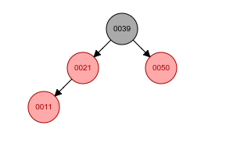
   
    插入后是上图所示情况，为情况3，父节点及父节点的兄弟节点变黑，祖父节点变红，当前节点变为祖父节点。
   
    
   
    此时当前节点为祖父节点且该节点是根节点同时又是红色的，问题转化成情况1，把根节点变为红色即可。

4. 当前节点的父节点是红色，父节点的兄弟节点是黑色，当前节点是其父节点的右孩子
   
    以其父节点为新的当前节点，以当前节点为支点左旋    
   
    例：
   
    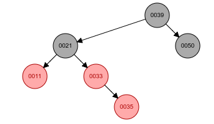
   
    插入后是上图所示情况，然后需要以其父节点为新的当前节点，以当前节点为支点左旋。
   
    
   
    这是问题又转化成情况3了，按情况3的方法把父节点及父节点的兄弟节点变为黑色，祖父节点变为红色即可。
   
    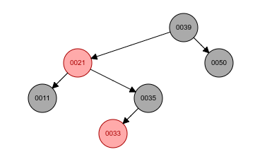

5. 当前节点的父节点是红色，父节点的兄弟节点是黑色，当前节点是其父节点的左孩子
   
    以祖父节点为支点右旋，父节点变黑，祖父节点变红。
   
    例：
   
    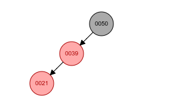
   
    插入后是上图所示情况，此时为情况5。以祖父支点为支点右旋。
   
    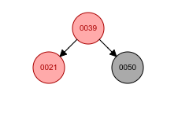
   
    父节点变黑，祖父节点变红。
   
    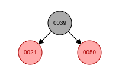

## 哈希表

​    `哈希表`是一种使用`哈希函数`组织数据，以支持快速插入和搜索的数据结构。

​    有两种不同类型的哈希表：哈希集合和哈希映射。

- `哈希集合`是`集合`数据结构的实现之一，用于存储`非重复值`。

- `哈希映射`是`映射` 数据结构的实现之一，用于存储`(key, value)`键值对。

​    通过选择合适的哈希函数，哈希表可以在插入和搜索方面实现`出色的性能`。

​    哈希表的关键思想是使用哈希函数`将键映射到存储桶`。更确切地说，

1. 当我们插入一个新的键时，哈希函数将决定该键应该分配到哪个桶中，并将该键存储在相应的桶中；
2. 当我们想要搜索一个键时，哈希表将使用相同的哈希函数来查找对应的桶，并只在特定的桶中进行搜索。

​    就比如说在下文中使用到的去留余数法函数为例子，假设使用函数`y = x % 5`作为哈希函数，欲插入key为8的记录，因为8%5=3，故我们把记录存储在索引为3的位置中。

### 除留余数法创建哈希表

​    使用去留余数法创建哈希表时模数最好选择素数，为什么除留余数法创建哈希表的时候所使用的模数最好是素数？

​    首先我们知道素数的因数除了1以外就是其本身，而合数的因数除了1和其本身之外还有其他因数。下面我们先看一个例子：

​    将一系列的数字作为key存入到哈希表中，有两个模数6（因数有1，2， 3,  6)，7（素数）

​    假定有两串输入序列:

> 第一个输入序列：2,4,6,8,10,12,14,16,18
> 
> 第二个输入序列：3,6,9,12,15,18,21,24,27

​    先用模数7分别用两个输入序列创建哈希表，

| 0   | 1   | 2   | 3   | 4   | 5   | 6   |
| --- | --- | --- | --- | --- | --- | --- |
| 14  | 8   | 2   | 10  | 4   | 12  | 6   |
|     |     | 16  |     | 18  |     |     |

| 0   | 1   | 2   | 3   | 4   | 5   | 6   |
| --- | --- | --- | --- | --- | --- | --- |
| 21  | 15  | 9   | 3   | 18  | 12  | 6   |
|     |     |     | 24  |     |     | 27  |

观察上面两个表可以知道以2或3递增的递增序列在其中分部非常均匀。

然后我们在用模数6创建哈希表，

| 0   | 1   | 2   | 3   | 4   | 5   |
| --- | --- | --- | --- | --- | --- |
| 6   |     | 2   |     | 4   |     |
| 12  |     | 8   |     | 10  |     |
| 18  |     | 14  |     | 16  |     |
|     |     |     |     |     |     |

| 0   | 1   | 2   | 3   | 4   | 5   |
| --- | --- | --- | --- | --- | --- |
| 6   |     |     | 3   |     |     |
| 12  |     |     | 9   |     |     |
| 18  |     |     | 15  |     |     |
| 24  |     |     | 21  |     |     |
|     |     |     | 27  |     |     |

​    通过对下面两个表与上面两个表做对比就能够看出，模数为6对以其因数递增的输入序列存储分布过于集中，而模数为7的则相对分散。

​    如果在容器当中存储过于集中就会造成对记录进行访问时还要进行一次时间相对较长的查找，一定程度上增加了查找的时间。

​    另外除了模数选择以外，在存储的时候不可避免的会遇见哈希值相同的记录，导致存储位置发生碰撞。在这里使用到解决碰撞的方法是同哈希值记录存储在同一链表中。

​    这种取模+数组+链表的实现如下：

```java
import java.util.ArrayList;
import java.util.LinkedList;

public class hashMap{
    private static int MOD_VAL = 521;

    private ArrayList<Bucket> arr;

    public hashMap() {
        this.arr = new ArrayList<Bucket>();
        for(int i=0;i<MOD_VAL;i++) {
            arr.add(new Bucket());
        }
    }

    public void add(int key,int value) {
        arr.get(key%MOD_VAL).update(key, value);
    }

    public void remove(int key) {
        arr.get(key%MOD_VAL).remove(key);
    }

    public boolean contains(int key) {
        return arr.get(key%MOD_VAL).contains(key);
    }
}

class Bucket{
    private LinkedList<Pair<Integer,Integer>> list = new LinkedList<Pair<Integer,Integer>>();

    public void update(int key,int value) {
        boolean found_flag = false;
        for(Pair<Integer,Integer> p:list) {
            if((Integer)p.getFirst() == key) {
                found_flag = true;
                p.setSecond(value);
            }
        }
        if(!found_flag)
            list.add(new Pair<Integer,Integer>(key,value));
    }

    public void remove(int key) {
        for(int i=0;i<list.size();i++) 
            if(list.get(i).getFirst()==key)
                list.remove(i);
    }

    public boolean contains(int key) {
        for(Pair<Integer,Integer> p:list) {
            if(p.getFirst()==key)
                return true;
        }

        return false;
    }
}

class Pair<K,V>{
    private K first;
    private V second;

    public K getFirst() {
        return first;     
    }
    public void setFirst(K first) {
        this.first = first;
    }
    public V getSecond() {
        return second;
    }
    public void setSecond(V second) {
        this.second = second;
    }
    public Pair(K first, V second) {
        super();
        this.first = first;
        this.second = second;
    }
}
```
