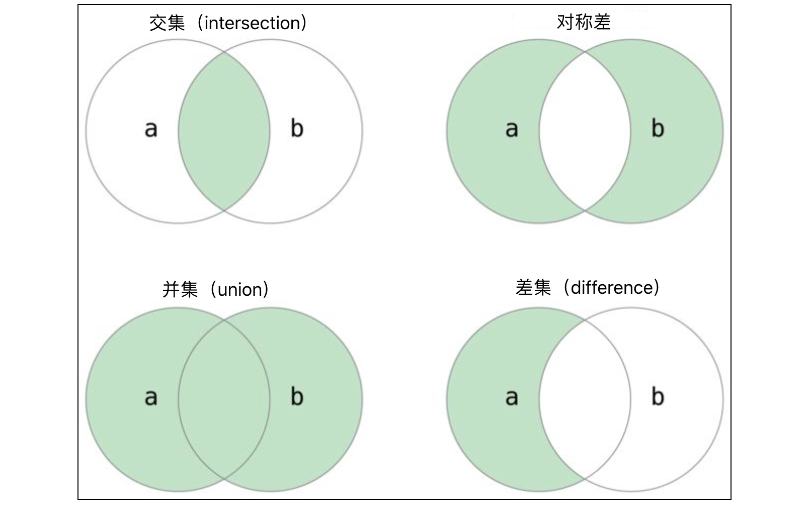

# Python

## 基础知识

### 数据结构

#### 列表

```Bash
# 创建一个空列表
items = []

# 向列表中添加元素
items.append("apple")
items.append("banana")
items.append("orange")
items.append("orange")
items.append("orange")
items.append("grape")

# 索引运算
items[1]

# 反向索引（访问倒数第n个元素）
items[-1]

# 重复运算(既将列表内的运算重复n次)
items * 3

# 存在判断
"apple" in items

# 切片运算[start,end,stride]
items[0:4:2]


# 插入元素到指定位置（超过列表长度时，会自动添加元素到末尾）
items.insert(5, "grape")

# 删除元素（指定位置）
items.pop(2)

# 删除最后一个元素
items.pop()

# 元素位置索引
items.index("banana")

# 元素出现次数
items.count("apple")

# 列表排序
items.sort()

# 列表反转
items.reverse()


# 嵌套列表
items = [[1,2],[1,2,3],1]
```

**列表推导式**

语法结构： `[exp (`**`for item in condition`**`) (if condition) ]`

```Python
class Pair:
    a: int
    b: int

    def __init__(self, a: int, b: int):
        self.a = a
        self.b = b


pairs = [Pair(a=t[0], b=t[1]) for t in [(1, 2), (3, 4), (5, 6, 7)] if len(t) == 2]

for pair in pairs:
    print(pair.a, pair.b)
```

#### 元组

定义：多个元素按照一定顺序构成的序列，但不可变

特点：操作基本与列表一致，因为不可变的原因更加适合应用在多线程场景，性能更高

```Python
# 定义一个三元组
t1 = (35, 12, 98)
# 定义一个四元组
t2 = ('骆昊', 43, True, '四川成都')

# 查看元组中元素的数量
print(len(t1))  # 3
print(len(t2))  # 4

# 索引运算
print(t1[0])    # 35
print(t1[2])    # 98
print(t2[-1])   # 四川成都

# 切片运算
print(t2[:2])   # ('骆昊', 43)
print(t2[::3])  # ('骆昊', '四川成都')

# 循环遍历元组中的元素
for elem in t1:
    print(elem)

# 成员运算
print(12 in t1)         # True
print(99 in t1)         # False
print('Hao' not in t2)  # False

# 拼接运算
t3 = t1 + t2
print(t3)  # (35, 12, 98, '骆昊', 43, True, '四川成都')

# 比较运算
print(t1 == t3)            # False
print(t1 >= t3)            # False
print(t1 <= (35, 11, 99))  # False

# 解包
a,b,c = (1,2,3)
```

#### 字符串

##### 字符串的**定义**

- 字符串是由零个或多个字符组成的有限序列。
- 在 Python 中，字符串可以用单引号或双引号包围（可以使用`'` `"` 包裹单行字符串，对于多行字符串可以使用`'''`或`"""`）。
- 字符串中的字符可以是特殊符号、英文字母、中文字符等。

```Python
str1 = 'str1'
str2 = "str2"
multi_str1 = '''
multi_str1
'''
multi_str2 = """
multi_str2
"""
```

##### **转义字符**

- 反斜杠 `\` 用于表示转义字符，例如 `\n` 表示换行，`\t` 表示制表符。

```Python
str_1 = 'line1\nline2'
print(str1)
"""
Output:
line1
line2
"""
```

##### **原始字符串**

- 以 `r` 或 `R` 开头的字符串称为原始字符串，既其中每个字符都是其本来的含义。

```Python
str_1 = 'line1\nlin2'
str_2 = r'line1\nline2'
print(str_1)
print(str_2)
'''
Output:
line1
line2
line1\nline2
'''
```

##### 字符的特殊表示

- 可以使用八进制或十六进制数来表示字符。
- 使用 `\u` 后跟 Unicode 字符编码来表示字符。

##### 字符串的运算

- **拼接和重复**：可以使用 `+` 运算符拼接字符串，使用 `*` 运算符重复字符串。

```Python
str_a = 'aaaaa'
str_b = 'bbbbb'
print(str_a+str_b)
'''
Output:
aaaaabbbbbbb
'''
print(str_a * 2)
'''
Output:
aaaaaaaaaa
'''
```

- **比较运算**：可以使用 `==`、`!=`、`<`、`>` 等运算符进行字符串比较（字符串的大小比较比的是每个字符对应的编码的大小）。
- **成员运算**：可以使用 `in` 和 `not in` 判断一个字符串是否包含另一个字符或字符串。

```python
s1 = 'hello, world'
s2 = 'goodbye, world'
print('wo' in s1)      # True
print('wo' not in s2)  # False
print(s2 in s1)        # False
```

- **获取字符串长度**：使用 `len()` 函数获取字符串的长度。

```python
s = 'hello, world'print(len(s))                 # 12
print(len('goodbye, world'))  # 14
```

- **索引和切片**：可以通过正向或反向整数索引访问字符串中的元素，但不能通过索引修改字符串。

```python
s = 'abc123456'
n = len(s)
print(s[0], s[-n])    # a a
print(s[n-1], s[-1])  # 6 6
print(s[2], s[-7])    # c c
print(s[5], s[-4])    # 3 3
print(s[2:5])         # c12
print(s[-7:-4])       # c12
print(s[2:])          # c123456
print(s[:2])          # ab
print(s[::2])         # ac246
print(s[::-1])        # 654321cba
```

##### 字符的遍历

- 可以使用 `for-in` 循环遍历字符串中的每个字符。

方式一：

```python
s = 'hello'for i in range(len(s)):
    print(s[i])
```

方式二：

```python
s = 'hello'for elem in s:
    print(elem)
```

##### 字符串的方法

- **大小写相关操作**：可以使用 `capitalize()`、`title()`、`upper()`、`lower()` 方法进行大小写变换。
- **查找操作**：可以使用 `find()`、`index()`、`rfind()`、`rindex()` 方法查找字符串中的子字符串。
- **性质判断**：可以使用 `startswith()`、`endswith()` 方法判断字符串是否以某个字符串开头或结尾。
- **格式化**：可以使用 `center()`、`ljust()`、`rjust()`、`zfill()` 方法进行字符串的格式化。
- **修剪操作**：可以使用 `strip()`、`lstrip()`、`rstrip()` 方法修剪字符串中的空白字符。
- **替换操作**：可以使用 `replace()` 方法替换字符串中的子字符串。
- **拆分与合并**：可以使用 `split()` 方法将字符串拆分为列表，使用 `join()` 方法将列表合并成字符串。
- **编码和解码**：可以使用 `encode()` 和 `decode()` 方法进行字符串的编码和解码。

#### 集合

##### 集合的定义

- 集合是一种无序的、不重复的数据结构，每个元素的地位都是相同的，元素之间是无序的。

##### 集合的创建

- 可以使用`{}`字面量语法创建集合，也可以使用内置函数`set`将其他序列转换成集合。
- 使用生成式语法也可以创建集合。

```python
set1 = {1, 2, 3, 3, 3, 2}
print(set1)

set2 = {'banana', 'pitaya', 'apple', 'apple', 'banana', 'grape'}
print(set2)

set3 = set('hello')
print(set3)

set4 = set([1, 2, 2, 3, 3, 3, 2, 1])
print(set4)

set5 = {num for num in range(1, 20) if num % 3 == 0 or num % 7 == 0}
print(set5)
```

##### 集合的遍历

- 不能通过索引运算来遍历集合中的元素，因为集合元素没有特定的顺序。可以使用`for-in`循环进行遍历。

```python
set1 = {'Python', 'C++', 'Java', 'Kotlin', 'Swift'}
for elem in set1:
    print(elem)
```

##### 集合的运算

- **成员运算**：可以通过`in`和`not in`检查元素是否在集合中。
- **二元运算**：包括交集、并集、差集、对称差等，可以通过运算符或方法实现。



```python
set1 = {1, 2, 3, 4, 5, 6, 7}
set2 = {2, 4, 6, 8, 10}

# 交集
print(set1 & set2)                      # {2, 4, 6}
print(set1.intersection(set2))          # {2, 4, 6}

# 并集
print(set1 | set2)                      # {1, 2, 3, 4, 5, 6, 7, 8, 10}
print(set1.union(set2))                 # {1, 2, 3, 4, 5, 6, 7, 8, 10}

# 差集
print(set1 - set2)                      # {1, 3, 5, 7}
print(set1.difference(set2))            # {1, 3, 5, 7}

# 对称差
print(set1 ^ set2)                      # {1, 3, 5, 7, 8, 10}
print(set1.symmetric_difference(set2))  # {1, 3, 5, 7, 8, 10}
```

- **比较运算**：可以使用`==`和`!=`进行相等性判断，可以使用`>` `<` `>=` `<=`来进行是否子集/父集运算，还可以通过`issubset`和`issuperset`方法判断集合之间的关系。

```python
set1 = {1, 3, 5}
set2 = {1, 2, 3, 4, 5}
set3 = {5, 4, 3, 2, 1}

print(set1 < set2)   # True
print(set1 <= set2)  # True
print(set2 < set3)   # False
print(set2 <= set3)  # True
print(set2 > set1)   # True
print(set2 == set3)  # True

print(set1.issubset(set2))    # True
print(set2.issuperset(set1))  # True
```

##### 集合的方法

- 可以通过集合的方法向集合添加元素或从集合中删除元素。

```python
set1 = {1, 10, 100}

# 添加元素
set1.add(1000)
set1.add(10000)
print(set1)  # {1, 100, 1000, 10, 10000}

# 删除元素
set1.discard(10)
if 100 in set1:
    set1.remove(100)
print(set1)  # {1, 1000, 10000}

# 清空元素
set1.clear()
print(set1)  # set()
```

- 还有一个名为`isdisjoint`的方法可以判断两个集合有没有相同的元素。

```python
set1 = {'Java', 'Python', 'C++', 'Kotlin'}
set2 = {'Kotlin', 'Swift', 'Java', 'Dart'}
set3 = {'HTML', 'CSS', 'JavaScript'}
print(set1.isdisjoint(set2))  # False
print(set1.isdisjoint(set3))  # True
```

#####  不可变集合

- Python 中还有一种不可变类型的集合，名字叫`frozenset`。`frozenset`由于是不可变类型，能够计算出哈希码，因此它可以作为`set`中的元素。

#### 字典

##### 字典的定义

字典（Dictionary）是一种无序、可变且可迭代的数据类型，用于存储键值对（key - value pairs）。每个键值对中的键（key）必须是唯一的，且键必须是不可变的数据类型，如字符串、数字或元组；而值（value）可以是任意数据类型，包括列表、字典等。

##### 字典的创建

```python
xinhua = {
    '麓': '山脚下',
    '路': '道，往来通行的地方；方面，地区：南～货，外～货；种类：他俩是一～人',
    '蕗': '甘草的别名',
    '潞': '潞水，水名，即今山西省的浊漳河；潞江，水名，即云南省的怒江'
}
print(xinhua)
person = {
    'name': '王大锤',
    'age': 55,
    'height': 168,
    'weight': 60,
    'addr': '成都市武侯区科华北路62号1栋101', 
    'tel': '13122334455',
    'emergence contact': '13800998877'
}
print(person)

# dict函数(构造器)中的每一组参数就是字典中的一组键值对
person = dict(name='王大锤', age=55, height=168, weight=60, addr='成都市武侯区科华北路62号1栋101')
print(person)  # {'name': '王大锤', 'age': 55, 'height': 168, 'weight': 60, 'addr': '成都市武侯区科华北路62号1栋101'}

# 可以通过Python内置函数zip压缩两个序列并创建字典
items1 = dict(zip('ABCDE', '12345'))
print(items1)  # {'A': '1', 'B': '2', 'C': '3', 'D': '4', 'E': '5'}
items2 = dict(zip('ABCDE', range(1, 10)))
print(items2)  # {'A': 1, 'B': 2, 'C': 3, 'D': 4, 'E': 5}

# 用字典生成式语法创建字典
items3 = {x: x ** 3 for x in range(1, 6)}
print(items3)  # {1: 1, 2: 8, 3: 27, 4: 64, 5: 125}
```

##### 字典的运算

```python
person = {'name': '王大锤', 'age': 55, 'height': 168, 'weight': 60, 'addr': '成都市武侯区科华北路62号1栋101'}

# 成员运算
print('name' in person)  # True
print('tel' in person)   # False

# 索引运算
print(person['name'])
print(person['addr'])
person['age'] = 25
person['height'] = 178
person['tel'] = '13122334455'
person['signature'] = '你的男朋友是一个盖世垃圾，他会踏着五彩祥云去迎娶你的闺蜜'
print(person)

# 循环遍历
for key in person:
    print(f'{key}:\t{person[key]}')
```

Tips: 在通过索引运算获取字典中的值时，如指定的键没有在字典中，将会引发`KeyError`异常。

##### 字典的方法

- 使用`get`方法可以通过健来获取对应的值。`get`方法在字典中没有指定的键时不会产生异常，而是返回`None`或指定的默认值。

```python
person = {'name': '王大锤', 'age': 25, 'height': 178, 'addr': '成都市武侯区科华北路62号1栋101'}
print(person.get('name'))       # 王大锤
print(person.get('sex'))        # None
print(person.get('sex', True))  # True
```

- 如果需要获取字典中所有的键，可以使用`keys`方法；如果需要获取字典中所有的值，可以使用`values`方法。字典还有一个名为`items`的方法，它会将键和值组装成二元组。

```Python
person = {'name': '王大锤', 'age': 25, 'height': 178}
print(person.keys())    # dict_keys(['name', 'age', 'height'])
print(person.values())  # dict_values(['王大锤', 25, 178])
print(person.items())   # dict_items([('name', '王大锤'), ('age', 25), ('height', 178)])
for key, value in person.items():
    print(f'{key}:\t{value}')
```

- 字典的`update`方法实现两个字典的合并操作。既将传入的字典参数值更新到现有字典中，如果键值对不存在则会创建该键值对。

```Python
person1 = {'name': '王大锤', 'age': 55, 'height': 178}
person2 = {'age': 25, 'addr': '成都市武侯区科华北路62号1栋101'}
person1.update(person2)
print(person1)  # {'name': '王大锤', 'age': 25, 'height': 178, 'addr': '成都市武侯区科华北路62号1栋101'}

# Python 3.9 及以上的版本可以使用 | 运算符完成该操作
person1 |= person2
print(person1)  # {'name': '王大锤', 'age': 25, 'height': 178, 'addr': '成都市武侯区科华北路62号1栋101'}
```

- 可以通过`pop`或`popitem`方法从字典中删除元素，前者会返回（获得）键对应的值，但是如果字典中不存在指定的键，会引发`KeyError`错误；后者在删除元素时，会返回（获得）键和值组成的二元组。字典的`clear`方法会清空字典中所有的键值对。

```Python
person = {'name': '王大锤', 'age': 25, 'height': 178, 'addr': '成都市武侯区科华北路62号1栋101'}
print(person.pop('age'))  # 25
print(person)             # {'name': '王大锤', 'height': 178, 'addr': '成都市武侯区科华北路62号1栋101'}
print(person.popitem())   # ('addr', '成都市武侯区科华北路62号1栋101')
print(person)             # {'name': '王大锤', 'height': 178}
person.clear()
print(person)             # {}
```

- 跟列表一样，从字典中删除元素也可以使用`del`关键字，在删除元素的时候如果指定的键索引不到对应的值，一样会引发`KeyError`错误，具体的做法如下所示。

```python
person = {'name': '王大锤', 'age': 25, 'height': 178, 'addr': '成都市武侯区科华北路62号1栋101'}
del person['age']
del person['addr']
print(person)  # {'name': '王大锤', 'height': 178}
```

### 函数

#### 装饰器

```python
import time
from functools import wraps

def timer_decorator(func):
    """装饰器：记录函数执行时间"""
    @wraps(func)
    def wrapper(*args, **kwargs):
        # 记录开始时间
        start_time = time.time()
        
        # 执行原函数
        result = func(*args, **kwargs)
        
        # 计算执行时间
        end_time = time.time()
        execution_time = end_time - start_time
        
        # 打印执行时间
        print(f"函数 {func.__name__} 执行时间: {execution_time:.4f} 秒")
        
        return result
    return wrapper

@timer_decorator
def print_loop_1000(msg:str):
    for i in range(1000):
        print(msg)

# 执行装饰后的函数
print_loop_1000("hello world")
# 执行原函数
print_loop_1000.__wrapped__("hello world")
```

### 面向对象

#### __slots__

#### @staticmethod与@classmethod

装饰器staticmethod将方法装饰为静态方法

装饰器classmethod将方法装饰为类方法

#### @property