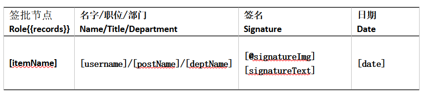
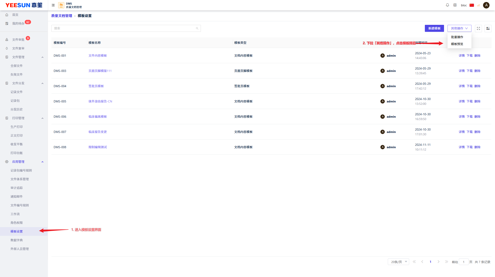
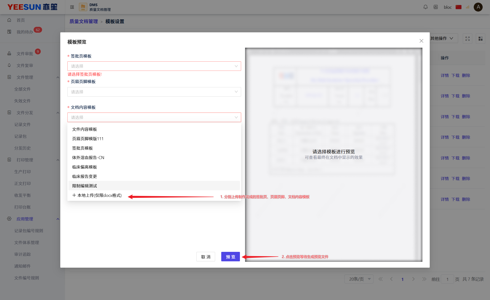
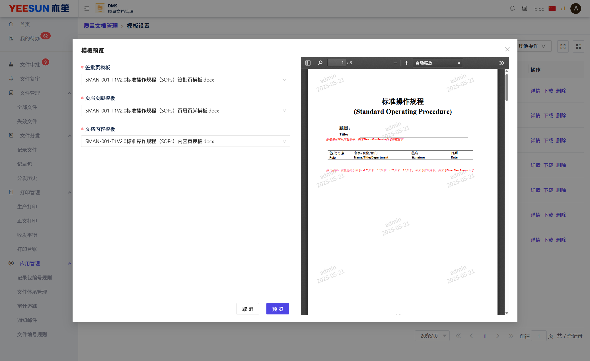

# DMS 文件模板制作说明书

注意：在 DMS 内模板与起草文件均使用 docx 格式的 Word 文档，请使用 Word 2016 及以上版本。

## 一、模板拆分

在 DMS 系统内，将线下使用的完整文件拆分成三个部分：签批页模板、内容页模板、页眉页脚模板
其中，签批页模板仅包含文件的签批页内容，内容页模板仅包含文件的内容页内容，页眉页脚模板仅包含文件的页眉页脚内容。
在 DMS 系统内起草文件时，用户只需要对内容页进行编辑即可，完成内容起草工作后，在最终生效时，系统将会自动合成签批页并自动插入页眉页脚合并生成最终的生效文件。

## 二、字段标签预埋

因使用时，用户可能需要将诸如：文件编号、文件名称、文件版本、文件生效日期等信息自动注入到文档中，但是注入的前提是用户需要将字段标签预埋到模板文件内，最终系统识别到字段标签后将字段标签的内容替换为文件的实际属性。
在系统内提供有以下字段标签：
- **{{cnName}}**：文件名称
- **{{enName}}**：文件英文名称
- **{{documentNo}}**：文件编号
- **{{versionNo}}**: 文件版本号
- **{{draftDepartment}}**：起草部门
- **{{distributeDepartment}}**：分发部门
- **{{effectDate}}**：文件生效日期（文件实际生效的日期）
- **{{expiryDate}}**：文件复审到期日期
- **{{publishDate}}**：文件发布日期（文件生效审批通过的日期）
- **{{records}}**：签批页信息
    - **\[itemName]**: 签批项名称（即起草审批的审批节点名称）
    - **\[username]**: 签批人名称
    - **\[deptName]**: 签批人部门名称
    - **\[postName]**: 签批人岗位名称
    - **\[@signatureImg]**: 电子签名
    - **\[signatureDate]**：签批人名称（电子签名缺省时使用）
    - **\[date]**：签批时间

除{{record}}标签外，可以在模板文件的任意位置预埋，而{{record}}标签仅支持在表格内使用。

使用参考下图：

1. 在表格标题行（首行）任意位置埋入{{records}}标签
2. 在表格第二行任意位置插入 `[]` 包裹的标签

完成字段标签预埋后将模板保存为 **docx** 格式即可

## 三、模板校验

1. 进入模板预览界面

2. 上传模板文件并发起预览

3. 查看预览文件

   右侧 PDF 预览组件中显示的即为生成后

   
